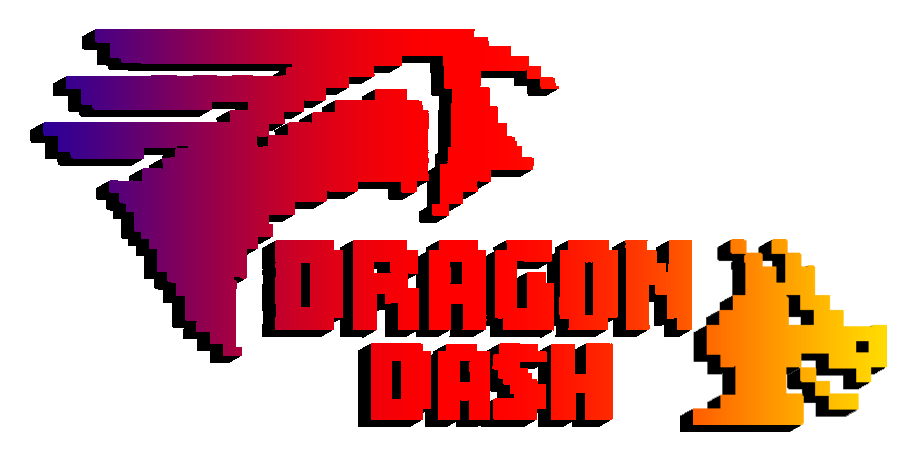

<div align="center">
  
  <h1 style="font-size: 32px; border: none; line-height: 0; font-weight: bold">Dragon Dash</h1>
  <p>Um projeto feito na Unity como requisito para a disciplina de Programação de Jogos Digitais</p>
    <div style="margin-bottom: 10px">
    
    
    </div>
    <br>
</div>

# Links Rápidos

- [Descrição](#descrição)
- [Tags](#tags)
- [Arquivos](#arquivos)
- [Uso](#uso)
- [Licença](#licença)

## Descrição

### A Lenda do Vale dos Céus Eternos

Em um mundo mágico e sem fim, lendas falam sobre um lugar escondido além dos limites do céu e das estrelas: o **Vale dos Céus Eternos**, um reino lendário onde dragões podem voar livremente, sem medo, livres dos perigos e dos desafios do mundo.

Guiado pelo desejo de encontrar esse lugar, um jovem dragão parte em uma jornada incansável pelos céus, pelas florestas e até pelo espaço sideral. Para enfrentar os perigos do caminho, ele domina **três poderes elementais**:

- **Fogo** 🔥
- **Gelo** ❄️
- **Eletricidade** ⚡

O dragão usa cada um desses poderes como desejar, adaptando-se ao ambiente para enfrentar os desafios que surgem.

### Cenários e Desafios

Nessa busca eterna, o dragão sobrevoa diferentes territórios mágicos, cada um com seus próprios perigos e obstáculos:

**Nível das Nuvens:**
> Flutuando acima das nuvens densas, o dragão precisa desviar dos obstáculos formados por nuvens mágicas e derrotar inimigos que tentam atingi-lo com trovões.

**Nível da Floresta:**
> Atravessando o topo das copas das árvores, o caminho é bloqueado por troncos e galhos mágicos que surgem repentinamente. O dragão deve utilizar seus poderes para destruir as árvores, além de enfrentar criaturas da floresta.

**Nível do Espaço:**
> Longe da terra, voando entre as estrelas, o dragão precisa desviar dos asteroides flutuantes e resistir aos ataques das criaturas cósmicas, que surgem do vazio do universo para testar sua resistência.

Não importa qual caminho escolha, o dragão está sempre em movimento, usando seus poderes para atacar, se defender e sobreviver.

### Uma Jornada Sem Fim

Dizem que, em algum lugar além das nuvens, das florestas e das estrelas, o Vale dos Céus Eternos realmente existe, mas ninguém jamais conseguiu alcançá-lo. 

Nosso jovem dragão voa incansavelmente, sempre buscando, sempre superando os desafios infinitos que surgem à sua frente. Sua jornada nunca tem fim, pois cada novo voo é uma nova oportunidade de chegar mais perto do vale ou, quem sabe, de provar que a verdadeira essência está na busca eterna, no desafio, na aventura e no desejo de voar cada vez mais alto.

## Tags
- Unity

## Arquivos
O projeto está organizado com a seguinte estrutura de diretórios:

```
dragon-dash/
├── Assets/
│   ├── characters/                       # Personagens e prefabs
│   │   ├── Enemies/                      # Inimigos (Pássaro, Nuvem, Dragão Metálico)
│   │   └── player/                       # Personagens de dragão do jogador e animações
│   │       ├── EletricDragon/            # Dragão elétrico com animações e poderes
│   │       ├── FireDragon/               # Dragão de fogo com animações e poderes
│   │       ├── IceDragon/                # Dragão de gelo com animações e poderes
│   │       └── StandardDragon/           # Personagem dragão básico
│   │
│   ├── levels/                           # Recursos específicos de níveis
│   │   ├── UI_assets/                    # Elementos de UI e transições
│   │   ├── clouds_level/                 # Recursos e prefabs do nível de nuvens
│   │   ├── florest_level/                # Recursos e prefabs do nível de floresta
│   │   ├── space_level/                  # Recursos e prefabs do nível do espaço
│   │   └── generic_pipe/                 # Obstáculos de canos comuns
│   │
│   ├── scenes/                           # Cenas do jogo
│   │   ├── MenuScene.unity               # Cena do menu principal
│   │   ├── LevelScene.unity              # Cena de seleção de nível
│   │   ├── clouds_level.unity            # Gameplay do nível de nuvens
│   │   ├── florest_level.unity           # Gameplay do nível de floresta
│   │   └── space_level.unity             # Gameplay do nível do espaço
│   │
│   ├── scripts/                          # Scripts do jogo
│   │   ├── Enemies/                      # Scripts de comportamento de inimigos
│   │   ├── Managers/                     # Scripts de gerenciamento do jogo
│   │   │   ├── AudioManagerScript.cs     # Gerenciamento de sistema de áudio
│   │   │   ├── GameLogic.cs              # Lógica principal do jogo
│   │   │   ├── GameSceneManagerScript.cs # Gerenciamento de cenas
│   │   │   └── LevelLoader.cs            # Sistema de carregamento de níveis
│   │   ├── Pipes/                        # Scripts de obstáculos de canos
│   │   ├── Player/                       # Scripts do personagem do jogador
│   │   ├── PowerUp/                      # Scripts do sistema de power-ups
│   │   └── environment/                  # Scripts de ambiente e cenário
│   │
│   ├── Sounds/                           # Arquivos de áudio do jogo
│   │   ├── Cloud - Theme.mp3             # Música do nível de nuvens
│   │   ├── Forest - Theme.mp3            # Música do nível de floresta
│   │   ├── Space - Theme.mp3             # Música do nível do espaço
│   │   └── Prologue.mp3                  # Música do menu
│   │
│   ├── TextMesh Pro/                     # Sistema de renderização de texto
│   │   ├── Fonts/                        # Recursos de fontes
│   │   ├── Resources/                    # Recursos TMP
│   │   ├── Shaders/                      # Shaders de renderização de texto
│   │   └── Examples & Extras/            # Exemplos do TextMesh Pro
│   │
│   └── Settings/                         # Configurações e parâmetros do projeto
│
├── Packages/                             # Gerenciamento de pacotes Unity
│   ├── manifest.json
│   └── packages-lock.json
│
├── ProjectSettings/                      # Configuração do projeto Unity
│
├── game-denis.sln                        # Arquivo de solução
├── Assembly-CSharp.csproj                # Arquivo de projeto
├── .gitignore                            # Configuração de arquivos ignorados pelo Git
└── README.md                             # Documentação do projeto
```

## Uso

### Requisitos do Sistema

- **Windows**: Windows 10 ou superior
- **Linux**: Ubuntu 20.04 ou superior, ou distribuição equivalente
- **Memória**: 4GB RAM mínimo
- **Processador**: Intel Core i3 ou equivalente
- **Placa de Vídeo**: Integrada com suporte a DirectX 11 ou OpenGL 4.5
- **Espaço em Disco**: 500MB disponíveis

### Executando o Jogo

#### A partir dos Builds Pré-compilados

- Baixe a versão mais recente do jogo na seção de [Releases](https://github.com/itallovidal/dragon-dash/releases) ou use os builds incluídos no repositório.

#### Compilando o Projeto

Para desenvolvedores que desejam modificar o jogo:

1. Clone o repositório:
   ```
   git clone https://github.com/itallovidal/dragon-dash.git
   cd dragon-dash
   ```

2. Abra o projeto no Unity (versão 2022.3 LTS ou superior)
   - Inicie o Unity Hub
   - Clique em "Abrir" e selecione a pasta do projeto
   - Aguarde a importação dos assets

3. Para criar um novo build:
   - No menu do Unity, vá para `File > Build Settings`
   - Selecione a plataforma desejada (Windows/Linux)
   - Clique em "Build" e escolha o diretório de saída

### Controles

O jogo suporta teclado/mouse e gamepad:

**Teclado**:
- **Teclas de Espaço**: Voo
- **Seta para cima**: Ataque
- **ESC**: Pausar o Jogo

## Licença
Este projeto está licenciado sob a Licença [MIT](https://github.com/itallovidal/dragon-dash/blob/main/LICENSE.txt).